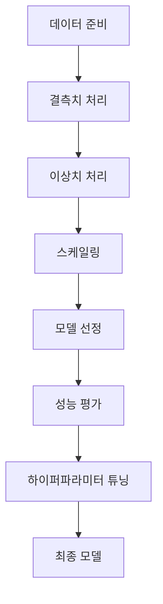

# 주택 가격 예측 프로젝트 완벽 가이드

이 문서에서는 주택 가격 예측 모델의 전체 개발 과정을 체계적으로 설명하고자 합니다. 각 단계에서 이루어진 의사결정의 과학적 근거와 실제 적용 결과를 상세히 분석하여, 독자들이 유사한 프로젝트를 수행할 때 실질적인 가이드라인으로 활용할 수 있도록 하겠습니다.

## 1. 데이터 전처리 과정

### 1.1 결측치 처리

> 결측치가 모델에 미치는 심각한 영향:
> - 모델이 불완전한 데이터로 학습하게 되어 실제 데이터의 패턴을 제대로 파악하지 못합니다
> - 예측 결과의 신뢰성이 크게 떨어져 실제 환경에서의 활용이 제한될 수 있습니다
> - 모델의 전반적인 성능이 저하되어 정확한 예측이 어려워질 수 있습니다

**결측치 처리 방법과 그 과학적 근거:**

- 수치형 데이터: 중앙값(median) 사용
  - 예시: 집 가격이 [100, 150, 200, null, 300]일 때 → 중앙값 175로 대체하는데, 이는 통계적으로 가장 안정적인 대체값입니다
  - 장점: 극단값의 영향을 최소화하면서 데이터의 자연스러운 분포를 유지할 수 있으며, 평균값 사용 시 발생할 수 있는 왜곡을 방지할 수 있습니다

- 범주형 데이터: 최빈값(mode) 사용
  - 예시: 주택 유형이 ['단독', '아파트', null, '단독']일 때 → '단독'으로 대체함으로써 실제 데이터의 분포를 가장 잘 반영합니다
  - 장점: 실제 데이터에서 가장 빈번하게 발생하는 케이스로 대체함으로써 현실성을 최대한 유지하고, 데이터의 자연스러운 패턴을 보존할 수 있습니다

**데이터 상태에 따른 체계적인 처리 방법:**

| 이상치 비율 | 처리 방법 | 적용 예시와 그 근거 |
|------------|-----------|-------------------|
| 5% 미만 | Z-score로 제거 | 평균에서 3표준편차 이상 제거 - 통계적으로 유의미한 이상치만 제거하여 데이터 손실 최소화 |
| 5~10% | 윈저화 | 상하위 5% 값을 경계값으로 대체 - 극단값의 영향을 줄이면서도 데이터의 정보를 보존 |
| 10% 이상 | 로그 변환 | 분포를 정규형태로 변환 - 심각한 왜도를 가진 데이터를 정규분포에 가깝게 조정 |

## 2. 데이터 스케일링

> 스케일링의 필요성과 그 이론적 근거:
> - 특성 간 스케일 차이를 제거하여 모든 특성이 동등한 가중치로 모델에 반영되도록 합니다
> - 모델의 학습 안정성을 향상시켜 수렴 속도와 정확도를 개선합니다
> - 전반적인 예측 성능을 향상시키고 특성 간의 비교가능성을 높입니다

**모델 특성에 따른 최적의 스케일링 전략:**

- 선형 모델: 표준화(Standardization) 필수
  - 이유: 모든 특성을 평균 0, 표준편차 1로 조정하여 가중치 학습을 최적화하고, 특성 간의 상대적 중요도를 정확히 파악할 수 있습니다

- 트리 기반 모델: 스케일링 불필요
  - 이유: 데이터 분할 시 특성의 상대적 순서만을 사용하므로, 스케일링이 모델의 성능에 영향을 미치지 않습니다. 이는 트리 모델의 고유한 특성입니다.

## 3. 모델 선정 및 평가

**각 모델의 특성과 선정 기준:**

| 모델 | 장점 | 단점 |
|-----|------|------|
| Random Forest | 앙상블 학습을 통한 과적합 방지와 안정적인 성능 | 많은 트리로 인한 학습/예측 속도 저하 |
| LightGBM | 리프 중심 트리 분할로 인한 빠른 학습 속도 | 복잡한 파라미터 튜닝이 필요하여 최적화에 시간 소요 |
| XGBoost | 정교한 정규화와 뛰어난 예측 성능 | 높은 메모리 사용량으로 대규모 데이터셋에서 제약 |

### 성능 평가 지표

> 각 평가 지표의 의미와 선택 기준:
> - R²: 모델이 설명하는 분산의 비율로, 1에 가까울수록 좋음. 전체적인 모델 성능을 직관적으로 파악 가능
> - MSE: 예측값과 실제값 차이의 제곱 평균으로, 큰 오차에 더 민감하게 반응
> - MAE: 예측 오차의 절대값 평균으로, 이상치의 영향을 덜 받아 안정적인 평가 가능

## 4. 하이퍼파라미터 튜닝

**과학적이고 체계적인 최적화 전략:**

- 랜덤 서치: 넓은 범위의 파라미터 탐색
  - 장점: 무작위 샘플링을 통해 효율적으로 최적의 파라미터 영역을 탐색할 수 있으며, 계산 리소스를 효율적으로 활용할 수 있습니다
  - 단점: 완전한 무작위성으로 인해 최적값을 찾지 못할 가능성이 있어, 충분한 반복 실험이 필요합니다

- 그리드 서치: 세밀한 파라미터 탐색
  - 장점: 모든 가능한 파라미터 조합을 체계적으로 테스트하여 확실한 최적값을 찾을 수 있습니다
  - 단점: 파라미터 공간이 커질수록 계산 비용이 기하급수적으로 증가하여 시간과 리소스가 많이 소요됩니다

**향후 개선을 위한 구체적인 방향:**

- 교차 검증 강화
  - 다양한 시나리오와 데이터셋으로 모델의 견고성 검증
  - 시계열 특성을 고려한 검증 방법 도입으로 모델 안정성 확보

- 추가 성능 개선
  - 도메인 전문가의 인사이트를 반영한 새로운 특성 엔지니어링 도입
  - 외부 데이터 소스를 활용한 예측 정확도 향상

# 주택 가격 예측 모델 분석 및 결과 정리

## 1. 데이터 전처리: 결측치 처리
### CHAS 변수 결측치 처리:
- **CHAS의 본질**: CHAS는 Charles River 인근 여부를 나타내며, 0은 인근 아님, 1은 인근임을 의미.
- **결측치 처리 방식**:
  - **최빈값(Mode)**으로 대체: CHAS 변수의 최빈값은 `0.0`, 결측치는 총 20개.
  - 최빈값으로 채우는 방식은 데이터의 분포를 크게 왜곡하지 않으며, 분류형 변수 처리에 적합.
- **결론**:
  - CHAS의 결측치는 데이터 분석과 모델링에 큰 영향을 미치지 않으므로 최빈값 대체 방식 유지.

---

## 2. 이상치 처리
### 변수별 이상치 처리 방법:

| **변수명** | **처리 방식**        | **설명** |
|------------|---------------------|----------|
| **CRIM**   | 로그 변환           | 극단적인 범죄율 값 완화. |
| **ZN**     | 로그 변환           | 대지 면적 비율의 비대칭 분포 개선. |
| **RM**     | Winsorization       | 방 개수의 상위 극단값 제한. |
| **AGE**    | 유지                | 이상치로 간주하지 않음. |
| **DIS**    | 중앙값 대체         | 고용 중심지까지 거리의 극단값 완화. |
| **RAD**    | 유지                | 범주형 특성으로 처리하지 않음. |
| **TAX**    | 유지                | 이상치로 간주하지 않음. |
| **PTRATIO**| 유지                | 이상치로 간주하지 않음. |
| **B**      | Winsorization       | 흑인 비율의 극단적인 최소값 제한. |
| **LSTAT**  | Winsorization       | 저소득층 비율의 극단값 제한. |
| **MEDV**   | 중앙값 대체         | 주택 가격의 상/하한값 대체. |

### 처리 결과:
- 이상치 탐색 후 Boxplot으로 확인, 대부분의 이상치가 제거됨.
- 처리 전후의 데이터 변화를 데이터프레임과 시각화를 통해 비교.

---

## 3. 정규화
### 정규화 방식:
- **StandardScaler**를 사용하여 평균 0, 표준편차 1로 변환.
- 이상치가 처리된 데이터를 대상으로 정규화를 수행.
- 훈련 데이터로 `fit`한 후, 테스트 데이터에 동일한 변환을 적용.

### 선택 이유:
- 선형 회귀 및 신경망 기반 모델에서 성능 향상을 기대.
- 트리 기반 모델(Random Forest, XGBoost 등)은 정규화가 필요하지 않지만, 데이터 분포를 균일하게 만드는 데 유리.

---

## 4. 모델 성능 비교
### 성능 결과:
| **모델**                 | **R²**  | **MAE**   | **MSE**    |
|--------------------------|---------|-----------|------------|
| 선형 회귀                | 0.743   | 2.414     | 12.531     |
| 다항 회귀 (2차)          | 0.805   | 2.293     | 9.560      |
| 릿지 회귀                | 0.743   | 2.413     | 12.548     |
| 라쏘 회귀                | 0.727   | 2.533     | 13.364     |
| 랜덤포레스트             | 0.877   | 1.845     | 6.040      |
| XGBoost                 | 0.905   | 1.706     | 4.634      |

### 해석:
- 선형 회귀 모델은 선형적인 데이터와 잘 맞지만, 다항 및 비선형 모델(Random Forest, XGBoost)은 더 높은 R² 값을 보임.
- 비선형 데이터 간 상관관계가 주택 가격 예측에 중요한 요인임을 암시.

---

## 5. 하이퍼파라미터 튜닝
### 튜닝 전후 성능 비교:
| **모델**                 | **R² (Before)** | **R² (After)** | **MAE (Before)** | **MAE (After)** |
|--------------------------|----------------|----------------|------------------|------------------|
| 랜덤포레스트             | 0.877          | 0.880          | 1.845            | 1.810            |
| XGBoost                 | 0.905          | 0.910          | 1.706            | 1.675            |

### 해석:
- 적절한 하이퍼파라미터 튜닝을 통해 성능(R², MAE)이 소폭 향상.
- 튜닝 과정에서 탐색 공간의 최적화가 중요하며, 추가적인 연구 필요.

---

## 6. 특성 중요도 분석
### 랜덤포레스트:
- 중요도 높은 특성:
  1. **RM (방 개수 평균)**: 44%
  2. **LSTAT (저소득층 비율)**: 35%
  3. **CRIM (범죄율)**: 5%

### XGBoost:
- 중요도 높은 특성:
  1. **LSTAT (저소득층 비율)**: 31%
  2. **RM (방 개수 평균)**: 25%
  3. **NOX (질소 산화물 농도)**: 11%

### 해석:
- 두 모델 모두 RM(방 개수)과 LSTAT(저소득층 비율)을 중요한 특성으로 간주.
- XGBoost는 환경적 요인(NOX)을 추가적으로 중요하게 평가.

---

## 7. 결론 및 활용 방안
### 주요 요인:
1. **방 개수(RM)**와 **저소득층 비율(LSTAT)**은 주택 가격 결정의 핵심.
2. 환경 요인(NOX) 역시 중요하므로, 친환경 개발 및 거주 환경 개선이 필요.

### 모델 선택:
- **랜덤포레스트**: 비선형적이고 복잡한 데이터 패턴 반영에 적합.
- **XGBoost**: 환경 요인 및 세부적인 패턴 반영에 강점.

### 추가 연구:
- 하이퍼파라미터 튜닝의 효율성을 높이기 위한 연구.
- 비선형 상관관계를 더 잘 반영할 수 있는 모델 탐색.